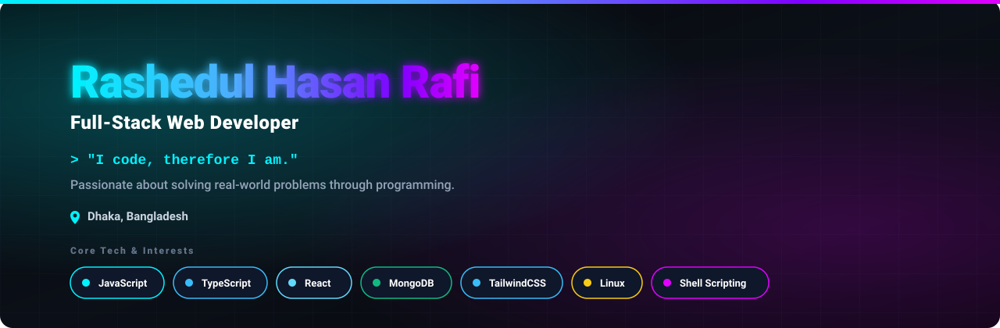

<!-- ## Hi there 👋-->

<!--
**1ysand3r/1ysand3r** is a ✨ _special_ ✨ repository because its `README.md` (this file) appears on your GitHub profile.

Here are some ideas to get you started:

- 🔭 I’m currently working on ...
- 🌱 I’m currently learning ...
- 👯 I’m looking to collaborate on ...
- 🤔 I’m looking for help with ...
- 💬 Ask me about ...
- 📫 How to reach me: ...
- 😄 Pronouns: ...
- ⚡ Fun fact: ...
-->
# Hi! Glad to see you here 👋

### I'm Rafi from Bangladesh. Passionate about programming to solve real world problems. Plus have great interest in Linux command line and shell scripting.

- 🌱 I’m currently learning **Web development using MERN stack + modern extras**

### Connect with me:

 

### Languages and Tools:

        
